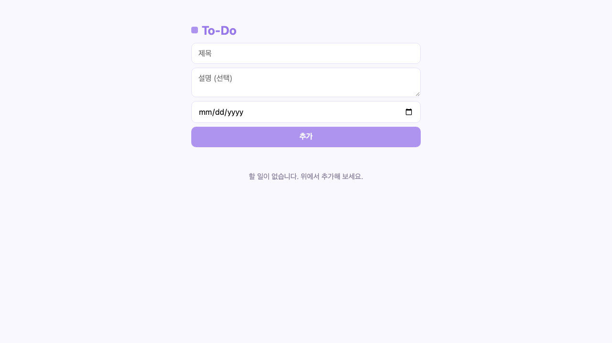
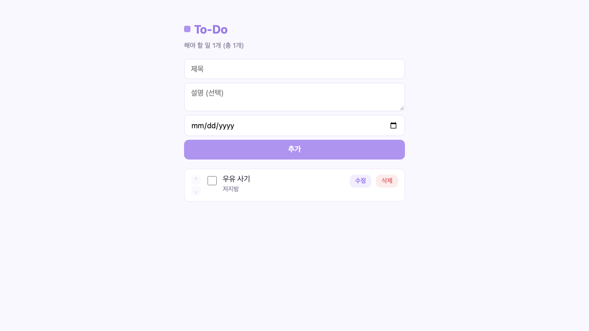
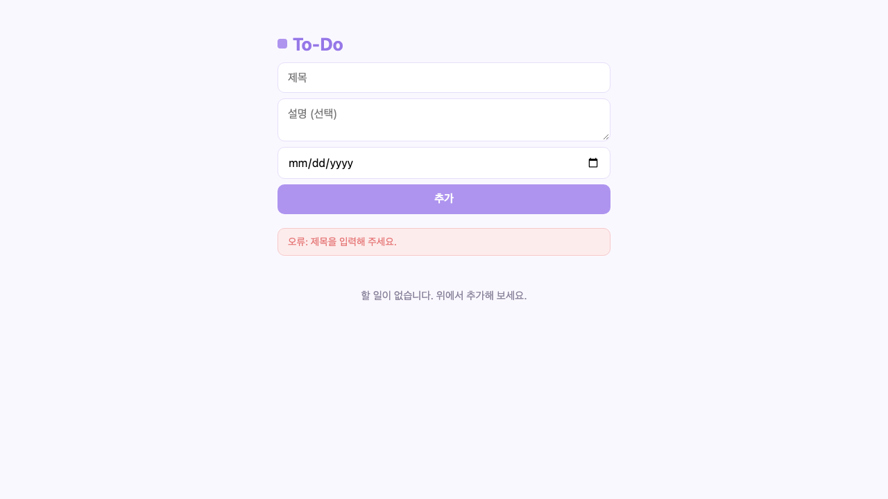
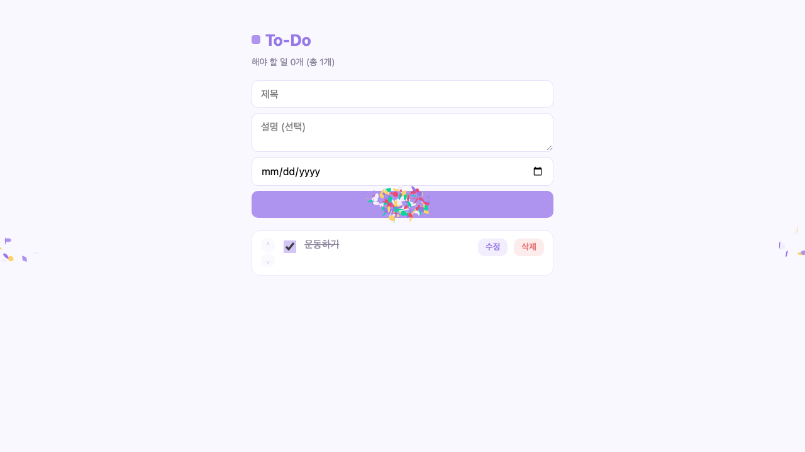
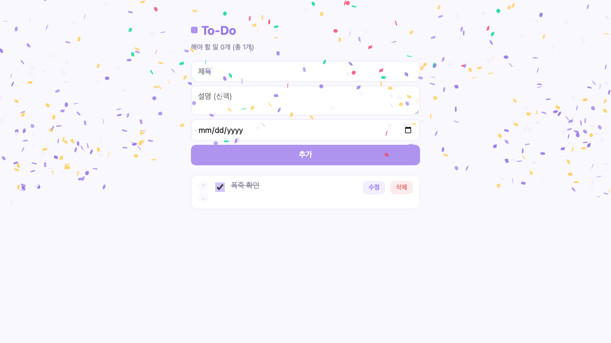
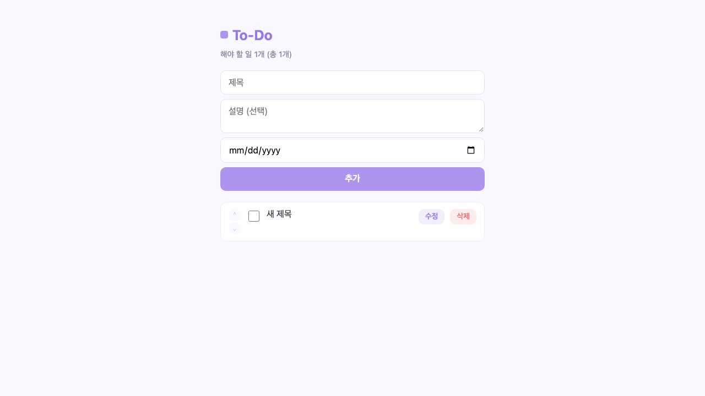
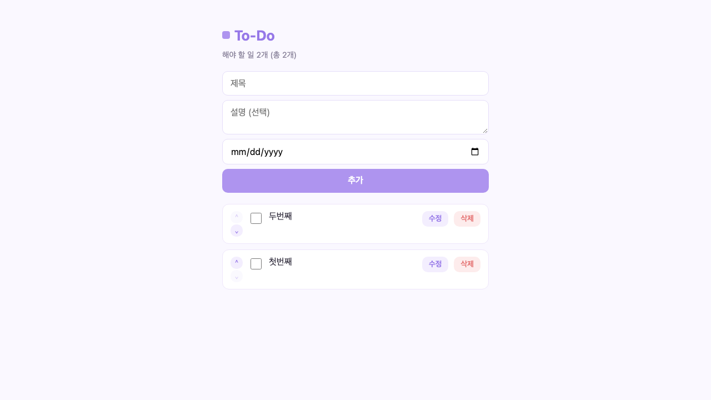
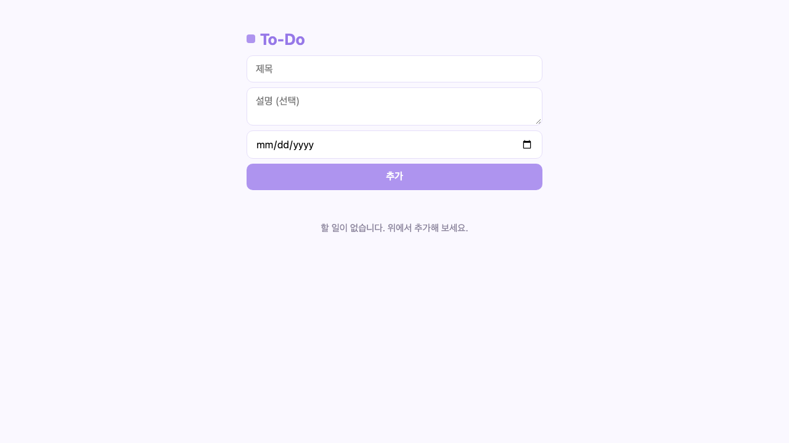
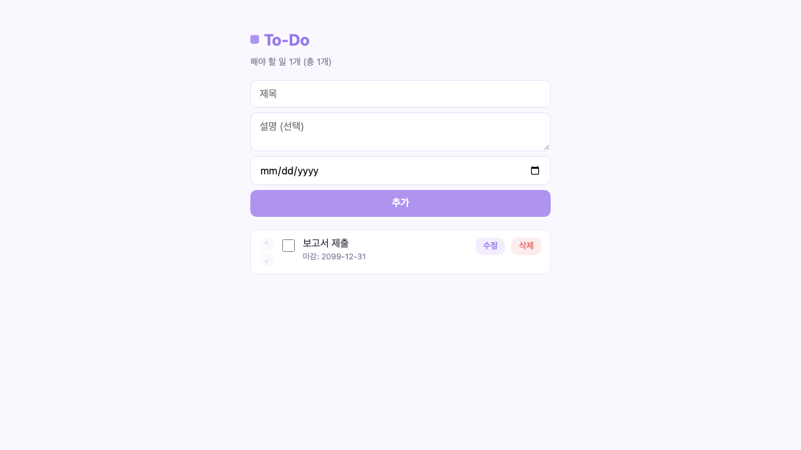
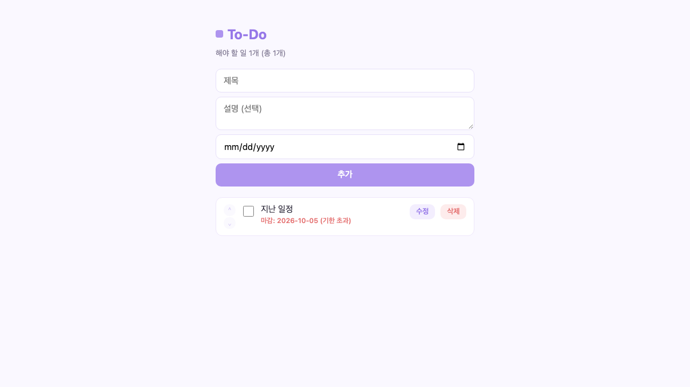

# UI 테스트 보고서 (Playwright)

## 결과 요약
| 항목 | 값 |
|---|---|
| 전체 | 21 |
| 통과 | 20 |
| 실패 | 1 |

## 테스트 범위와 결과

| 영역 | 테스트 | 결과 |
|---|---|---|
| 화면 | 제목과 빈 상태 메시지 표시 | 통과 |
| 추가 | 추가 후 목록/카운트 반영, 입력창 초기화 | 통과 |
| 추가 | Enter 키로 추가 | 통과 |
| 추가 | 제목 없이 추가 시 오류 메시지 | 통과 |
| 완료 | 체크 시 취소선과 카운트 갱신 | 통과 |
| 완료 | 체크 해제 시 완료 상태 제거 | 통과 |
| 완료 | 체크 시 폭죽 캔버스 생성 | 통과 |
| 완료 | CDN 차단 시에도 체크 상태 저장 | **실패** |
| 수정 | 제목 수정 저장 | 통과 |
| 수정 | Escape로 수정 취소 | 통과 |
| 수정 | 빈 제목 저장 시 오류 메시지 | 통과 |
| 우선순위 | 내리기/올리기 버튼으로 순서 변경 | 통과 (2건) |
| 우선순위 | 맨 위 올리기/맨 아래 내리기 버튼 비활성화 | 통과 |
| 우선순위 | 순서 변경이 새로고침 후에도 유지 | 통과 |
| 삭제 | 삭제 후 목록에서 제거 | 통과 |
| 상태 | 새로고침 후 항목 유지 | 통과 |
| 마감일 | 마감일 표시 | 통과 |
| 마감일 | 기한 초과 항목 강조 | 통과 |
| 마감일 | 완료된 항목은 기한 초과로 표시하지 않음 | 통과 |
| 마감일 | 마감일 수정 저장 | 통과 |

## 실패 상세: CDN 차단 시 완료 체크가 저장되지 않음

- 재현: `cdn.jsdelivr.net` 요청을 차단한 상태에서 체크박스를 누르고 새로고침하면 체크가 풀린 상태로 돌아갑니다.
- 원인: 체크 시 `fireConfetti()`를 먼저 호출하는데, CDN 스크립트가 없으면 `confetti is not defined` 예외가 발생합니다. 이 예외로 뒤의 `updateTodo()` 호출이 실행되지 않아 서버에 저장되지 않습니다.
- 콘솔 확인: `pageerror: confetti is not defined`
- 영향: CDN 장애나 사내망 차단 환경에서 완료 체크가 조용히 사라집니다. 사용자에게 오류 표시도 없습니다.
- 권장 수정: `fireConfetti()` 내부에서 `typeof confetti === "function"`을 확인하거나, `updateTodo()`를 폭죽 호출보다 먼저 실행합니다.

## 스크린샷

### 1. 빈 상태

### 2. 추가 후

### 3. 제목 누락 오류

### 4. 완료 체크

### 5. 폭죽 효과

### 6. 수정 후

### 7. 우선순위 변경 후

### 8. 삭제 후

### 9. 마감일 표시

### 10. 기한 초과 강조

## 결론
핵심 CRUD와 우선순위 기능은 UI에서 정상 동작합니다. 외부 CDN에 의존하는 폭죽 코드가 완료 저장을 막는 문제가 확인되었으며, 수정 후 재실행이 필요합니다.
